# Personnalisation du module Achat

## Introduction


Le module Achat d'Odoo propose déjà une fonctionnalité de double validation des commandes. Cela permet de renforcer le contrôle du processus d'approvisionnement et du suivi de budget.


Pour rappel, en activant la double validation des commandes, les utilisateurs ordinaires (<i>Groupe: Achats/Utilisateur</i>) se voient empêchés de valider une commande dépassant un montant prédéfini. Au lieu de passer automatiquement au statut "<i>Bon de commande</i>", la commande sera marquée comme "<i>À approuver</i>", nécessitant ainsi une validation supplémentaire par un utilisateur administrateur (<i>Groupe: Achats/Administrateur</i>).


Dans le but d’enrichir cette fonctionnalité, votre défi consiste à mettre en place les personnalisations suivantes:

### <b>Configurations</b> 


<i>Dans Achats > Configuration > Paramètres</i>


 1. Cocher pour la société principale "Approbation du bon de commande"<a id='1'></a>
 2. Fixer le montant minimum à 2500€<a id='2'></a>

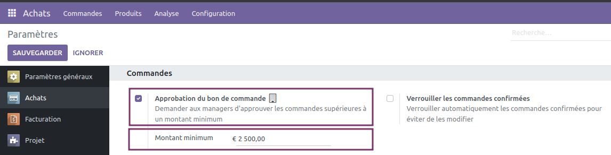

### <b>Commandes</b> 

 3. Déplacer le champ "Acheteur" au dessus du champ "Date d'échéance"<a id='3'></a>

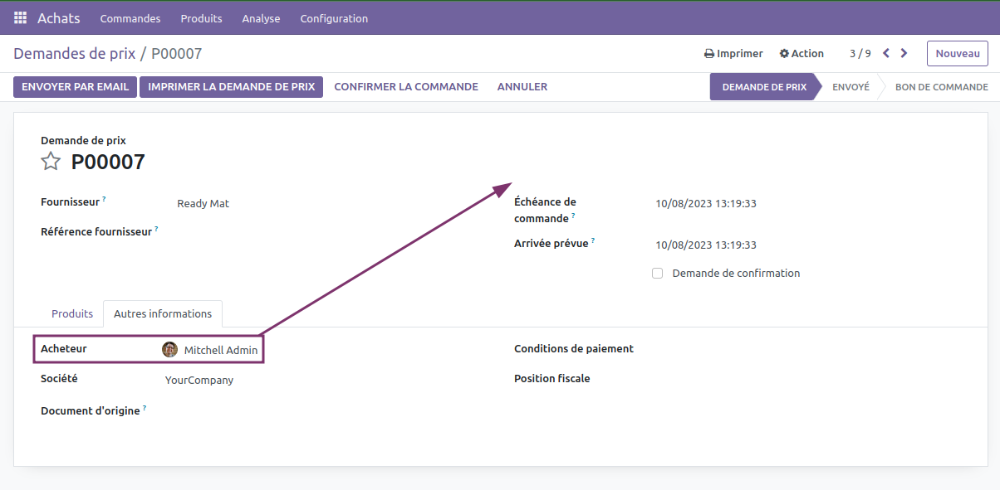

 4. Rendre le champs "Acheteur" vide par défaut<a id='4'></a>

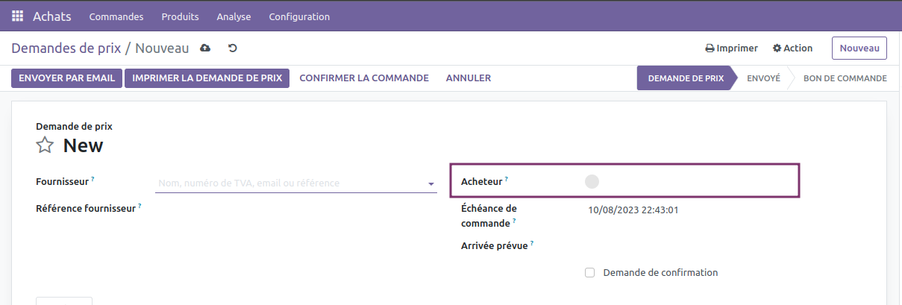

 5. S'assurer que le champ "Acheteur" soit vide suite à une duplication d'une commande<a id='5'></a>
 6. Bloquer la demande d’approbation si le champ "Acheteur" n’est pas renseigné<a id='6'></a><br/>
    Pour une commande dépassant le montant minimum (2500€), un utilisateur ordinaire ne pourra pas soumettre une demande de validation tant qu’il n’a pas désigné un Acheteur.

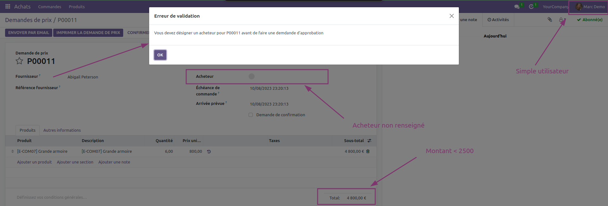

> ⚠️ <b><i>Lever une exception de type "ValidationError"</i></b>

 7. L’utilisateur connecté devient Acheteur si la commande n’est pas bloqué<a id='7'></a><br/>
    Si une commande n’a pas besoin d’une validation supplémentaire (ex: montant de la commande < montant minimum), l’utilisateur qui est en train d’effectuer la validation, qu’il soit administrateur ou pas, devient Acheteur pour la commande.

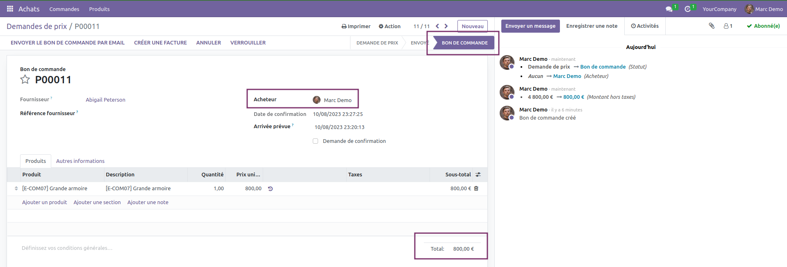

 8. Filtrer la liste affichée dans le champ "Acheteur"<a id='8'></a><br/>
    Filtrer le champ "Acheteur" pour n'afficher que les utilisateurs administrateurs.

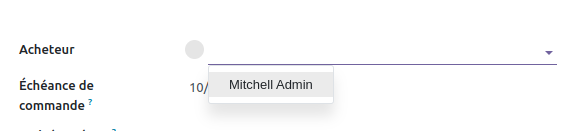

> ⚠️  <b><i>Définir le filtre depuis la vue XML</i></b> 

### <b>Fournisseurs</b>

 9. Pouvoir faire une exception pour certains fournisseurs<a id='9'></a><br/>
    Les fournisseurs dont le champ "Pas besoin d’approbation" est coché ne seront pas touchés par la contrainte du montant minimum. Ainsi tous les utilisateurs peuvent valider leurs commandes sans être interrompus par la règle de double validation.

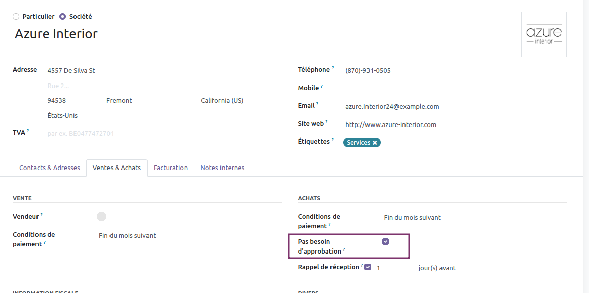

### <b>Menu "À approuver"</b> 


<i>Dans Achats > Commandes > À approuver</i>


 10. Filtrer les commande qui apparaissent dans le menu<a id='10'></a><br/>
    N’afficher que les commandes dont le statut est "À approuver" et dont l’acheteur est l’utilisateur connecté.


 11. Ajouter un bouton "Annuler" sur chaque ligne<a id='11'></a>

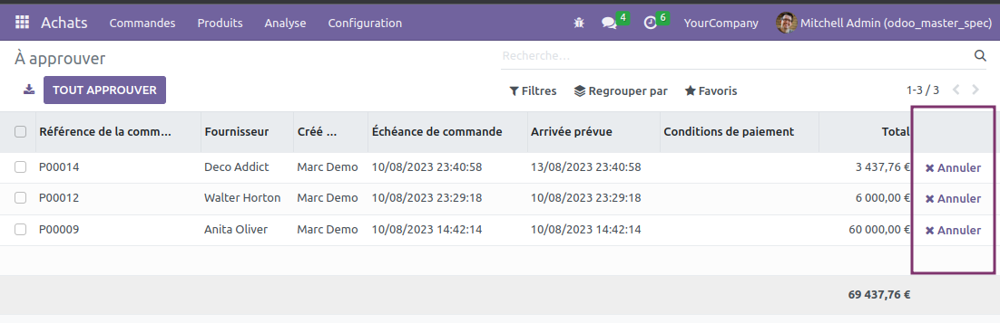

> ⚠️  <b><i>Utiliser "fa-times" pour la petite icône</i></b> 


 12. Pouvoir annuler en masse les commandes<a id='12'></a>

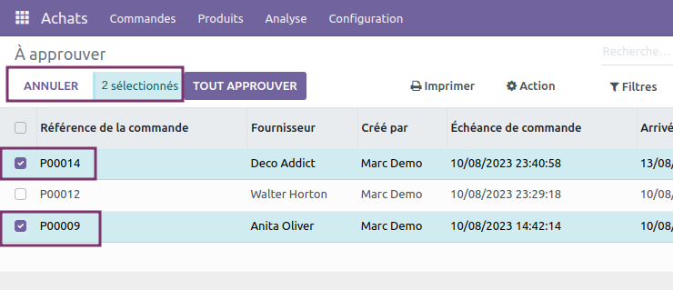

 13. Ajouter un message de confirmation avant de déclencher l'action d'annulation<a id='13'></a> 

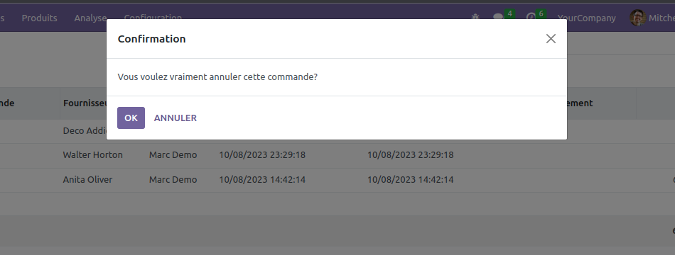

 14. Rendre le menu "À approuver" disponible que pour les administrateurs achats<a id='14'></a>
 15. Ne pas autoriser la création d'une commande depuis le menu "À approuver"<a id='15'></a>
 16. Afficher le total des montants en bas de la liste<a id='16'></a>

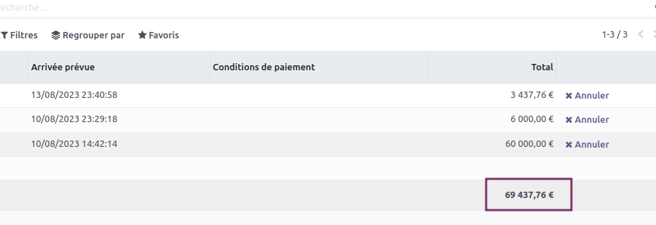

 17. Implémenter le bouton "Tout approuver"<a id='17'></a><br/>
    Le bouton "Tout approuver" permettra de valider toutes les commandes à l’état "À approuver" dont l’acheteur est l’utilisateur courant sans avoir à sélectionner les commandes à approuver.

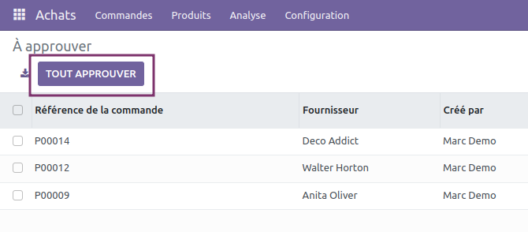

> ⚠️ <b><i>OWL</i></b>


## Soumettre votre module

* Récupération du module prédéfini

```bash
git clone https://github.com/ratastech/odoomaster2023.git
```
* Assurez-vous que vous êtes bien sur la branche `main`

```bash
git branch
```

* À partir de la branche `main`, créer la branche sur laquelle vous allez travailler 
```bash
git checkout -b votre_prenom
```

* Soumettre votre code
```bash
git add .
```
```bash
git commit -m "message du commit"
```
```bash
git push -u origin vote_prenom
```

## Récapitulatif et répartition des points

| <b>Rubriques</b>  | <b>Tâches</b>                                                                                                                                                   | <b>Pts</b> |
| --------------------------------------------------------------- |-----------------------------------------------------------------------------------------------------------------------------------------------------------------|----------|
| Configuration | [1](#1) - Cocher par défaut "Approbation du bon de commande"                                                                                                   | 1,5      |
|  | [2](#2) - Fixer le seuil d'approbation à 2500€                                                                                                                  | 1,5      |
| Commande | [3](#3) - Déplacer le champ "Acheteur" au dessus du champ "Date d'échéance"                                                                                     | 1        |
|  | [4](#4) - Rendre le champs "Acheteur" vide par défaut                                                                                                           | 0,5      |
|  | [5](#5) - S'assurer que le champ "Acheteur" soit vide après duplication d'une commande                                                                          | 0,5      |
|  | [6](#6) - Lever une exception de type "ValidationError" si la commande a besoin d'une approbation et que l'acheteur n'est pas renseigné au moment de valider    | 1      |
|  | [7](#7) - Au moment de valider, si la commande n'a pas besoin d'une approbation, l'acheteur deviendra automatiquement l'utilisateur qui est en train de valider | 1        |
|  | [8](#8) - Filtrer, depuis la vue XML, le champ "Acheteur" pour n'afficher que les utilisateurs appartenant au groupe Achat/Administrateur                       | 1        |
| Fournisseur | [9](#9) - Pouvoir faire une exception pour certains fournisseurs en utilisant le champ "Pas besoin d'approbation"                                               | 1,5      |
| À approuver | [10](#10) - Filtrer les commande qui apparaissent dans le menu "À approuver" (commande à l'état "À approuver" dont l'acheteur est l'utilisateur connecté)       | 0,5      |
|  | [11](#11) - Ajouter un bouton "Annuler" sur chaque ligne (Utiliser fa-times pour la petite icône)                                                               | 1        |
|  | [12](#12) - Pouvoir annuler en masse les commandes                                                                                                              | 1,5      |
|  | [13](#13) - Ajouter un message de confirmation avant de déclencher l'action d'annulation (que ce soit pour l'annulation par ligne ou en masse)                  | 0,5      |
|  | [14](#14) - Rendre le menu "À approuver" disponible que pour les Achat/Administrateur                                                                           | 0,5      |
|  | [15](#15) - Ne pas autoriser la création d'une commande depuis le menu "À approuver"                                                                            | 0,5      |
|  | [16](#16) - Afficher le total des montants à la fin de la liste                                                                                                 | 1        |
|  | [17](#17) - Implémenter le bouton "Tout approuver" pour pouvoir valider toutes les commandes à approuver (JS)                                                   | 5        |
| Partout | Traduction (Bonus)                                                                                                                                              | 1        |
